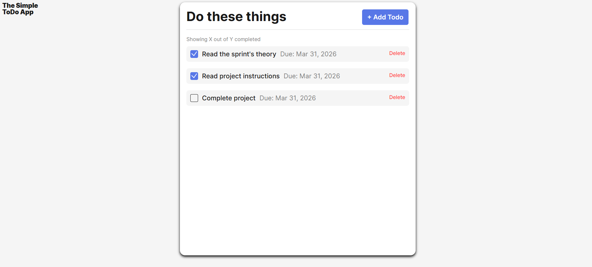

# Simple Todo App

A clean, intuitive task management application that helps users organize daily activities, track progress, and boost productivity.

## Functionality

The Simple Todo App allows users to:

- **Add new tasks** with a title and optional description
- **Mark tasks as complete** with a single click
- **Delete individual tasks** when no longer needed
- **Persist data** using browser local storage (tasks remain after page refresh)
- **Edit existing tasks** to update titles or descriptions
- **Set due dates** for time-sensitive tasks

## Technology

This project was built using the following technologies and techniques:

- **HTML5**
- **CSS3**
- **JavaScript**

_Main interface showing task list and add task form_

## Deployment

This project is deployed on GitHub Pages:

**[View Live Demo](https://jonn1193.github.io/se_project_todo-app/)**
